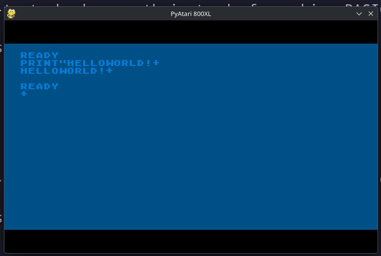

# PyAtari -- Educational Atari 800XL Emulator



An Atari 800XL emulator written in Python for educational purposes. The goal is
to help people understand how the computer works in detail by seeing it
represented in a modern, high-level programming language.

**This emulator prioritizes clarity and readability over performance.**
**No, I'm Not Kidding. It's really, REALLY slow! The goal is the code.**

## Hardware Emulated

- **CPU**: MOS 6502C at 1.79 MHz (NTSC)
- **Memory**: 64KB address space with bank switching
- **ANTIC**: Display list processor (video)
- **GTIA**: Color registers, player/missile graphics, collisions
- **POKEY**: 4-channel sound, keyboard, timers, serial I/O
- **PIA**: Joystick ports, memory configuration
- **SIO**: Serial bus for disk drives and peripherals

## Requirements

- Python 3.12+
- [uv](https://docs.astral.sh/uv/) for project management

## Setup

```bash
uv sync --extra dev
```

## Running

```bash
uv run pyatari
```

## ROM Images

This emulator requires Atari OS and BASIC ROM images to boot the full system.
These are copyrighted and not included. Place them in the `roms/` directory:

- `atarixl.rom` (16384 bytes) -- Atari XL/XE OS ROM
- `ataribas.rom` (8192 bytes) -- Atari BASIC ROM
- Optional self-test ROM: the emulator will also load a standalone self-test ROM
  from `roms/` when present. Supported filenames are `atarixlselftest.rom`,
  `atarixl-selftest.rom`, `atarixl_selftest.rom`, and `selftest.rom`.

The emulator can also run in "bare metal" mode without ROMs, loading raw 6502
machine code or XEX executables directly.

## Running Tests

```bash
uv run pytest
```

## Architecture Decisions

Architecture Decision Records live under `docs/adr/`. These documents capture
important design choices and the reasoning behind them as the emulator evolves.
